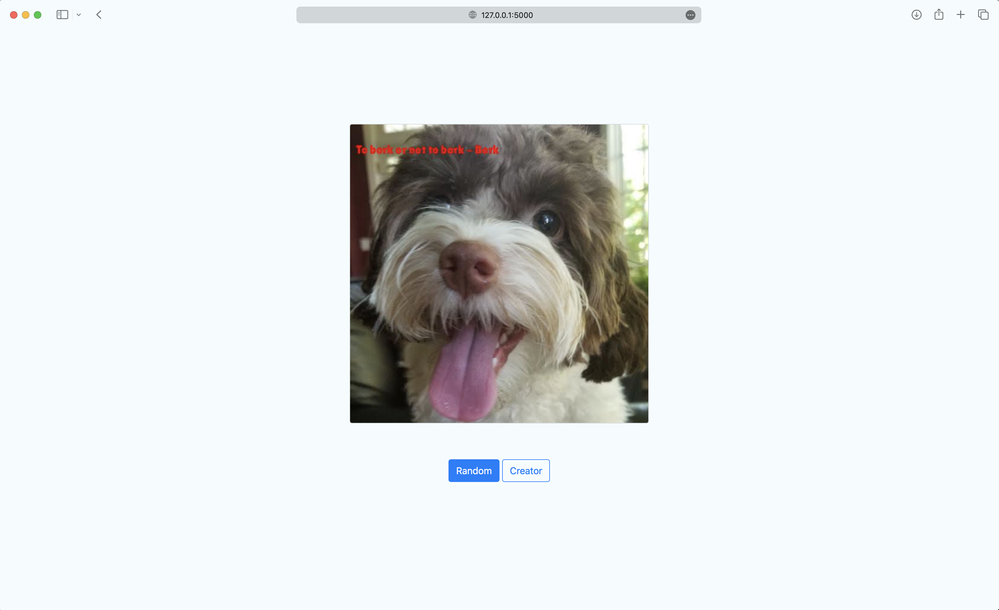

# Meme Generator
This project is built to create a picture, that includes a quote and the according author information.\
This can be achieved locally as well as served through a flask app server.

## CLI usage (local use only)

If you just want to create a file locally using only local data then you can execute the file called meme.py in the root
folder of this project.

usage: ```python3 meme.py [-h] [--path PATH] [--body BODY] [--author AUTHOR]```

options:\
&nbsp;&nbsp;&nbsp;&nbsp;-h, --help       show this help message and exit\
&nbsp;&nbsp;&nbsp;&nbsp;--path PATH      Path to an image file\
&nbsp;&nbsp;&nbsp;&nbsp;--body BODY      Quote body to add to the image\
&nbsp;&nbsp;&nbsp;&nbsp;--author AUTHOR  Quote author to add to the image

When no option is filled a random quote and image from the _data folder is being used.

### Test Case CLI

* go to project/src/
* execute python3 meme.py --path "./_data/photos/dog/xander_1.jpg" --body "You are a star" --author "Christian Gerhard"

The script will print the location and name of the file that has been generated

## Web-based usage
This project can also be served as a web app. For that you need to start the server by executing the file app.py in the 
root folder.

usage: ```python3 app.py```

Once started the first output on the console will look like this:

```commandline
Output:
1# * Serving Flask app 'app'
2# * Debug mode: on
3# WARNING: This is a development server. Do not use it in a production deployment. Use a production WSGI server instead.
4#  * Running on http://127.0.0.1:5000
5# Press CTRL+C to quit
6#  * Restarting with stat
7#  * Debugger is active!
8#  * Debugger PIN: xxx-xxx-xxx
``` 
Now open a web browser of your liking and enter the address the server is running on. (see line 4)\
You will see something like this\



### Test Case Webbased

When pressing the "Random" button a new quote and picture from the local database should be merged into a random Meme 
and displayed in the browser.\
Alternatively you can provide your own data by calling the Creator form using the "Creator" button. Here enter data such
as the one below and push the "Create Meme!" button. The engine will create a Meme with your provided data. 

Image URL
https://as2.ftcdn.net/v2/jpg/08/32/53/89/1000_F_832538986_Mp9sgjpmk9DLQzJR9SZKI9QinSQmgA6h.jpg

Quote Body
HotDogs are delicious

Quote Author
Christian

## Technical Specifications


```
.(projectroot)
├── readme.md
├── src
│   ├── MemeEngine
│   │   ├── MemeModel.py
│   │   └── __init__.py
│   ├── QuoteEngine
│   │   ├── CSVIngestor.py
│   │   ├── DocxIngestor.py
│   │   ├── Ingestor.py
│   │   ├── IngestorInterface.py
│   │   ├── PDFIngestor.py
│   │   ├── TXTIngestor.py
│   │   ├── __init__.py
│   │   └── quote.py
│   ├── _data
│   │   ├── DogQuotes
│   │   │   ├── DogQuotesCSV.csv
│   │   │   ├── DogQuotesDOCX.docx
│   │   │   ├── DogQuotesPDF.pdf
│   │   │   └── DogQuotesTXT.txt
│   │   ├── SimpleLines
│   │   │   ├── SimpleLines.csv
│   │   │   ├── SimpleLines.docx
│   │   │   ├── SimpleLines.pdf
│   │   │   └── SimpleLines.txt
│   │   └── photos
│   │       └── dog
│   │           ├── xander_1.jpg
│   │           ├── xander_2.jpg
│   │           ├── xander_3.jpg
│   │           └── xander_4.jpg
│   ├── app.py
│   ├── fonts
│   │   └── LilitaOne-Regular.ttf
│   ├── meme.py
│   ├── requirements.txt
│   ├── static
│   │   ├── tmp2tag2y4i.jpg
│   │   ├── tmp35qml5bu.jpg
│   │   ├── tmp_pbwq0a2.jpg
│   │   ├── tmpavh3vg4k.jpg
│   │   ├── tmpgoexqrtu.jpg
│   │   ├── tmpi0lshvss.jpg
│   │   ├── tmpjfbwwurq.jpg
│   │   ├── tmpn3ok5t9x.jpg
│   │   ├── tmps91z4t0g.jpg
│   │   └── tmpsdr8bumt.jpg
│   ├── templates
│   │   ├── base.html
│   │   ├── meme.html
│   │   └── meme_form.html
│   └── tmp
└── tree.txt
```